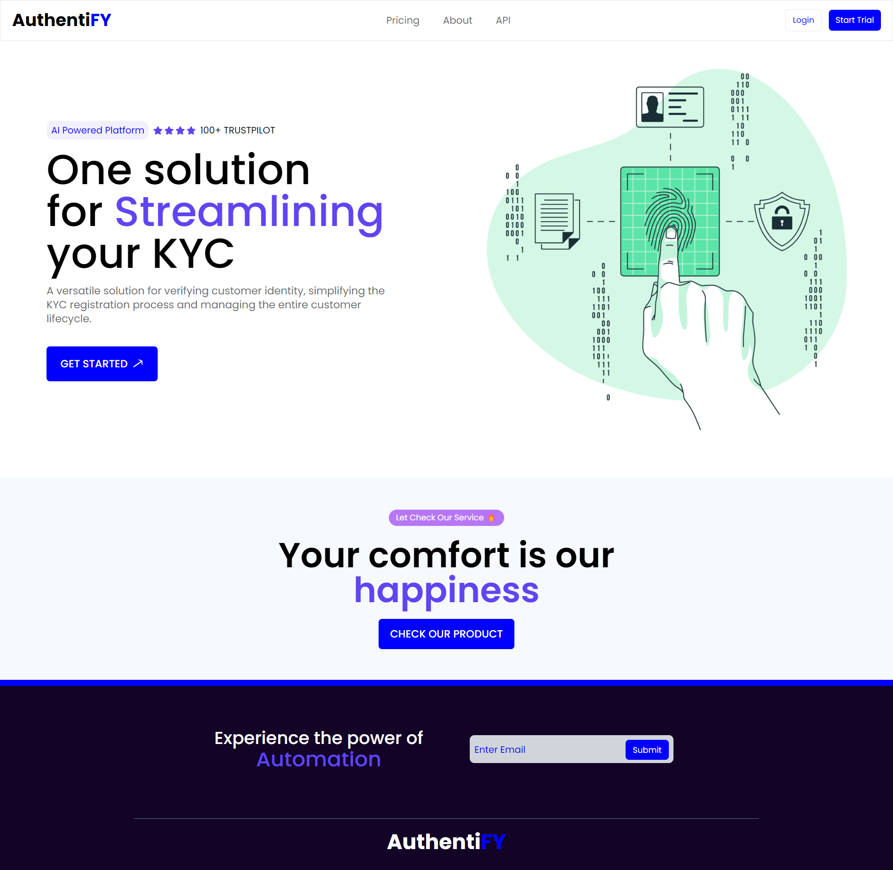
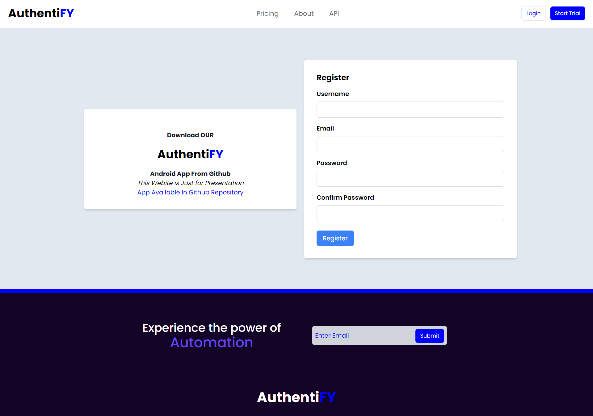
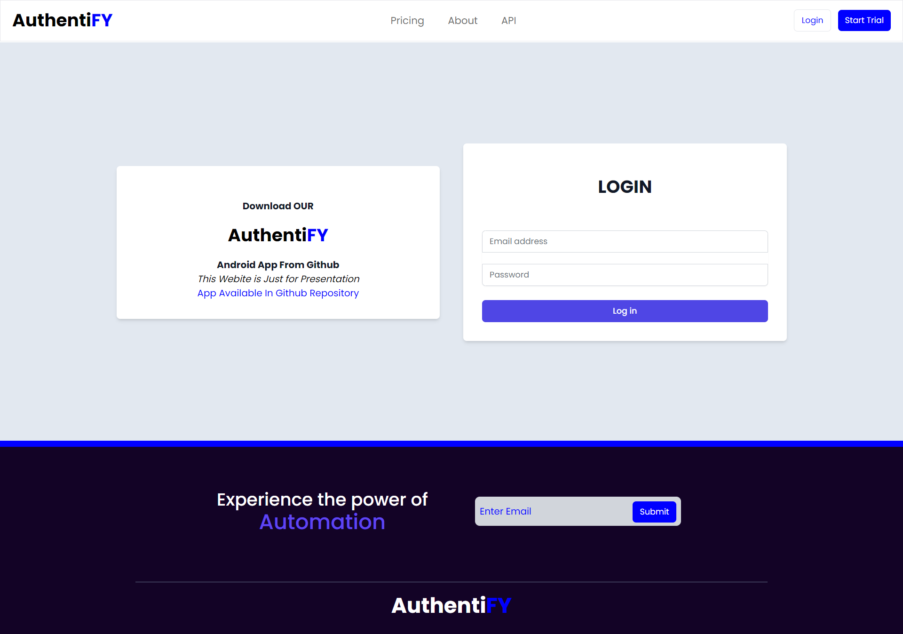

# Authenticity

Welcome to **Authenticity** - the next-generation KYC (Know Your Customer) application designed to simplify and secure the online identity verification process. Our application combines cutting-edge technology with user-friendly design to create an inclusive and accessible platform. Here, we aim to bridge the financial and educational divide by providing a seamless KYC experience that transcends language barriers and generational gaps.

You can view the website here: [KYC (authentifyy.vercel.app)](https://authentifyy.vercel.app/)

# APP DEMO - VIDEO
## English language Demo
[

## Multi language Support demo

# Webite Screenshots

## Features

**Authenticity** offers a range of features designed to make the online KYC process as intuitive, secure, and inclusive as possible:

- **Live Photograph Capture**: Securely capture your live photograph to verify your identity in real-time.
- **Comprehensive Data Collection**: Effortlessly provide your basic details, including name, date of birth (DOB), address, PAN card/Aadhaar number, signature, income range, and type of employment, through a conversational interface.
- **Multilingual Support**: Break language barriers with our multilingual support, ensuring that everyone, regardless of their language proficiency, can complete the KYC process with ease.
- **Accessibility Across Generations**: Designed to be intuitive for users of all ages, from digital natives to those less familiar with technology.
- **Ease Of Use**: Authenticity is designed with enhanced accessibility features, ensuring individuals with disabilities can navigate and complete the KYC process with ease, thanks to adaptive functionalities tailored to accommodate a wide range of physical and sensory needs.
- **Privacy and Security**: Your privacy is our priority. We employ state-of-the-art security measures to protect your personal information throughout the KYC process.

## Accessibility and Inclusion

At **Authenticity**, we believe that financial and digital inclusion is paramount. Our platform is designed to be highly inclusive, offering:

- Easy-to-understand instructions in multiple languages.
- A user interface that caters to users of all ages and abilities.
- Support for a wide range of devices to ensure high reach across different socioeconomic statuses.

## Security

We are committed to maintaining the highest standards of security and privacy. All data transmitted through our platform is encrypted, and personal information is stored securely, in compliance with global data protection regulations.

## Tech Stack Overview

**Authenticity** harnesses a modern and diverse tech stack for optimal performance and user experience:

- **Flutter**: Powers our mobile app for both iOS and Android, offering a rich, native-like UI from a single codebase.

- **React & Node.js**: Drives our web platform, with React for dynamic user interfaces and Node.js for efficient, scalable server-side operations.

- **AWS (Lambda, S3, Rekognition)**: Supports our backend with Lambda for serverless computing, S3 for data storage, and Rekognition for advanced image processing tasks.

- **OpenAI & Gemini API**: Facilitates natural and engaging chat experiences, using cutting-edge AI for conversational interactions.

- **MongoDB**: Manages our data with a flexible, scalable NoSQL database, ideal for handling varied data types and volumes.

This stack ensures a seamless, secure, and accessible KYC process across all devices and platforms.

Join us in making the digital world a more accessible, inclusive, and secure place with **Authenticity**.
